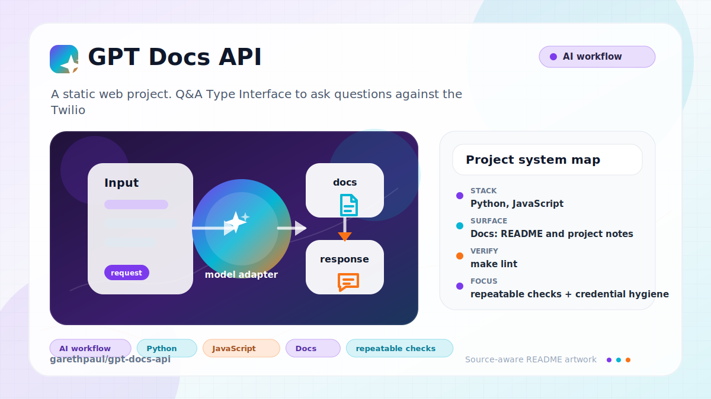

# gpt-docs-api

<!-- README-OVERVIEW-IMAGE -->


## Overview

`garethpaul/gpt-docs-api` is a static web project. Q&A Type Interface to ask questions against the Twilio docs with GPT-4.

This README is based on the checked-in source, manifests, scripts, and repository metadata on the `main` branch. The project language mix found during review was: Python (8), JavaScript (4).

## Repository Contents

- `CHANGES.md` - maintenance history
- `README.md` - project overview and local usage notes
- `api` - source or example code
- `chrome_extension` - source or example code
- `docs` - source or example code
- `Makefile` - local build or utility targets
- `SECURITY.md` - security reporting and disclosure guidance
- `VISION.md` - project direction and maintenance guardrails

Additional scan context:

- Source directories: api, chrome_extension, docs
- Dependency and build manifests: Makefile
- Entry points or build surfaces: Makefile
- Test-looking files: api/chalicelib/public/test.html, api/tests/test_cache.py, api/tests/test_classification.py, api/tests/test_utils.py, chrome_extension/test.html, docs/plans/2026-06-08-gpt-docs-api-testability-dependency-baseline.md

## Getting Started

### Prerequisites

- Git

### Setup

```bash
git clone https://github.com/garethpaul/gpt-docs-api.git
cd gpt-docs-api
```

The setup commands above are derived from repository files. Legacy mobile, Python, or JavaScript samples may require older SDKs or package versions than a modern workstation uses by default.

## Running or Using the Project

- Run `make` or inspect `Makefile` for available targets.

## Testing and Verification

Run the local verification gate before changing the API, cache, or classification helpers:

```bash
make verify
```

`make verify` runs deterministic unit tests without live OpenAI, Pinecone, AWS,
or Twilio credentials, compiles the Chalice app and helper modules, and runs
`scripts/check-baseline.sh` to protect dependency pins and source guardrails.

When the required SDK or runtime is unavailable, use static checks and source review first, then verify on a machine that has the matching platform toolchain.

## Configuration and Secrets

- Detected references to OpenAI, Twilio. Keep API keys, OAuth credentials, tokens, and account-specific values in local configuration only.
- Set `GPT_DOCS_API_KEY` in deployed API environments and send it as either `Authorization: Bearer <key>` or `X-API-Key: <key>` when calling AI-backed POST routes.

## Security and Privacy Notes

- Review changes touching external API calls or credential-adjacent configuration; examples from the scan include api/app.py, api/chalicelib/classification.py, api/chalicelib/public/content.css, api/chalicelib/public/content.js, and 6 more.
- Review changes touching network requests, sockets, or service endpoints; examples from the scan include api/chalicelib/public/content.js, api/chalicelib/public/manifest.json, api/chalicelib/public/segment-snippet.js, chrome_extension/content.js, and 2 more.
- Review changes touching file, media, JSON, XML, CSV, OCR, or data parsing; examples from the scan include api/app.py, api/chalicelib/classification.py, api/chalicelib/public/content.css, api/chalicelib/public/content.js, and 5 more.
- Review changes touching database, model, or persistence code; examples from the scan include api/chalicelib/classification.py, api/tests/test_classification.py, docs/plans/2026-06-08-gpt-docs-api-testability-dependency-baseline.md.
- Review changes touching infrastructure, proxy, cloud, or deployment configuration; examples from the scan include docs/plans/2026-06-08-gpt-docs-api-testability-dependency-baseline.md.

## Maintenance Notes

- See `SECURITY.md` for vulnerability reporting and safe research guidance.
- See `VISION.md` for project direction and contribution guardrails.
- See `CHANGES.md` for maintenance history.
- See `docs/plans/2026-06-08-gpt-docs-api-testability-dependency-baseline.md`
  for the current testability and dependency baseline.
- See `docs/plans/2026-06-08-source-baseline-guard.md` for the source guard.

## Contributing

Keep changes small and tied to the project that is already present in this repository. For code changes, document the toolchain used, avoid committing generated dependency directories or local configuration, and update this README when setup or verification steps change.
